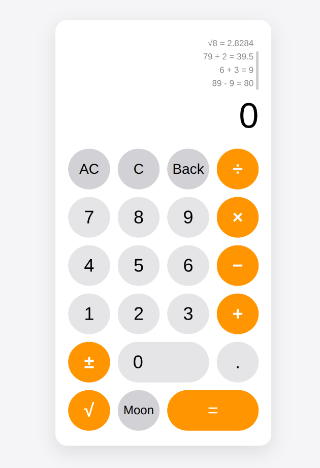
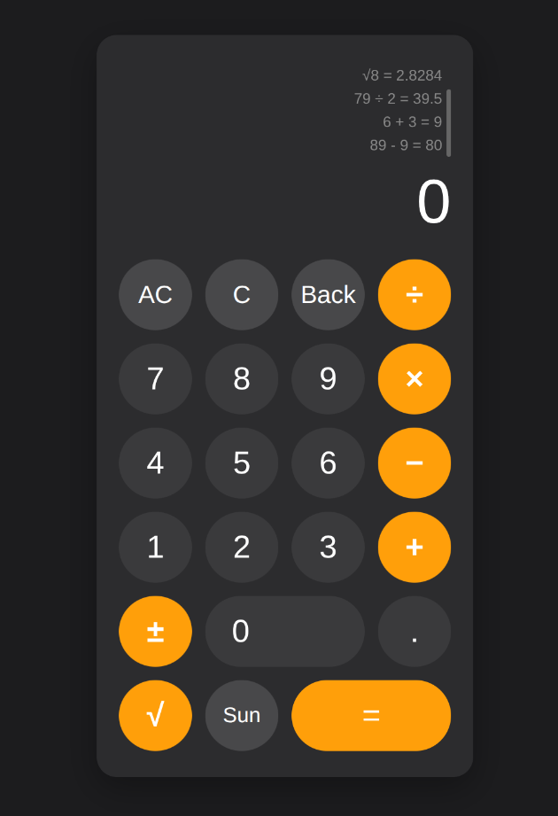

# iOS-Style Calculator  
**A modern, responsive calculator built with HTML, CSS, and ES6 JavaScript.**

Check it out: https://turarova.github.io/calculator-project/
---

## Features

- **Basic operations**: `+`, `−`, `×`, `÷`
- **Advanced**: `√` (square root), `±` (toggle sign)
- **Clear controls**: `C` (clear entry), `AC` (clear all), `Back` (backspace)
- **Calculation history**:
  - Stores **last 10 operations**
  - Displays **last 5** with **smooth scroll**
- **Light / Dark theme toggle** (`Moon` / `Sun`) saved in `localStorage`
- **Keyboard support** (numbers, operators, `Enter`, `Backspace`, `Escape`, `T`, `S`, `Space`)
- **iOS-inspired UI** with rounded buttons, subtle shadows, and responsive design

---

## ES6+ Features Used

| Feature | Example |
|--------|--------|
| **Classes** | `class Calculator { ... }` |
| **Arrow Functions** | `btn.addEventListener('click', () => { ... })` |
| **Template Literals** | `` `${a} + ${b} = ${result}` `` |
| **Array Methods** | `.unshift()`, `.pop()`, `.slice()`, `.map()`, `.join()` |
| **Default Parameters / Logical OR** | `localStorage.getItem(...) || 'light'` |
| **const / let** | Block-scoped variables |
| **Ternary Operator** | `isDark ? 'light' : 'dark'` |

---

## Project Structure
calculator/
├── img            → Images folder
  -- screen-dark.png
  -- screen-light.png
├── index.html     → Page structure
├── styles.css     → iOS-style design & dark mode
├── app.js         → Calculator logic (ES6 class)
└── README.md      → This file

---

## How to Run

1. **Clone or download** the project.
2. Open `index.html` in any modern browser (Chrome, Safari, Firefox, Edge).
3. Start calculating!

> No build tools or server required.

---

## Keyboard Shortcuts

| Key | Action |
|-----|--------|
| `0–9`, `.` | Enter number |
| `+`, `−`, `*`, `/` | Operators |
| `Enter` | `=` (calculate) |
| `Backspace` | Delete last digit |
| `Escape` | `AC` (clear all) |
| `c` / `C` | `C` (clear entry) |
| `s` / `S` | `√` (square root) |
| `t` / `T` | `±` (toggle sign) |
| `Space` | Toggle theme |

---

## Screenshots

| Light Mode | Dark Mode |
|-----------|----------|
|  |  |

---

## Authors

**Elima Kudaiberdieva, Aigerim Turarova**
